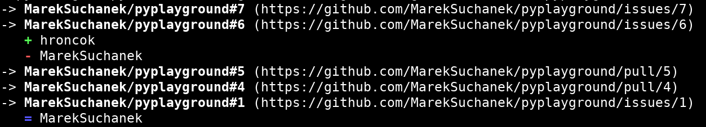
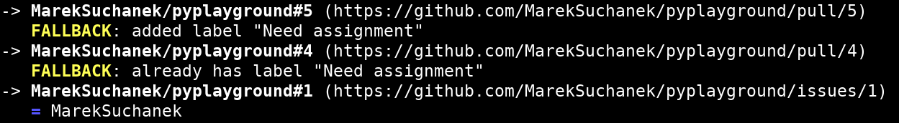
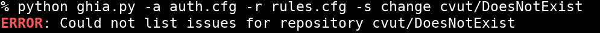
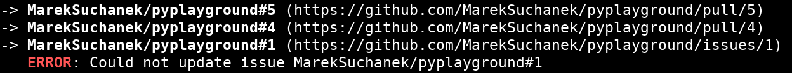

= GHIA I.
:toc:
:note-caption: :information_source:
:warning-caption: :warning:

== Zadání úkolu

Vaším úkolem za 5 bodů je vytvořit command line aplikaci pracující s GitHub API,
pomocí knihoven http://docs.python-requests.org[requests] a
http://click.pocoo.org[click].

Aplikace slouží k přiřazování issues na GitHub podle jejich obsahu. Příklad: Když
text issue obsahuje "network error", přiřadí se uživateli PepaNovak, protože je
expertem na sítě.

== Konfigurace

Aplikace používá 2 konfigurační soubory. V jednom z nich je token ke GitHub API,
ve druhém jsou definice pravidel pro přiřazování uživatelů k issues.
Oba jsou napsané ve formátu pro
https://docs.python.org/3/library/configparser.html[configparser].

credentials.cfg
[source,ini]
----
[github]
token=xxxxxxxxxxxxxxxxxxxxx
----

rules.cfg
[source,ini]
----
[patterns]
MarekSuchanek=
    title:network
    text:protocol
    text:http[s]{0,1}://localhost:[0-9]{2,5}
    label:^(network|networking)$
hroncok=any:Python

[fallback]
label=Need assignment
----

Pravidla vždy začínají jedním ze slov `title`, `text`, `label`, `any` určující,
kde se má výraz hledat. Dále za dvojtečkou následuje regulární výraz (case 
insensitive) pro použití s knihovnou https://docs.python.org/3/library/re.html[re].
Pozor, pravidel je pro uživatele potenciálně více (na každém řádku jedno pravidlo).
Dále se v tomto souboru konfiguruje štítek pro případ, že není nalezen dle pravidel
žádný uživatel pro přiřazení k issue. Pokud je již štítek na issue nastaven, nastavení
se již logicky neprovádí. Sekce `fallback` je nepovinná a pokud se v konfiguračním
souboru nenachází, pak se žádný štítek nenastavuje.

== Rozhraní pro příkazovou řádku

Soubor ke spuštění pojmenujte `ghia.py`.

Při jeho spuštění s příkazem `--help` očekáváme nápovědu:

[source]
----
Usage: ghia.py [OPTIONS] REPOSLUG 

  CLI tool for automatic issue assigning of GitHub issues

Options:
  -s, --strategy [append|set|change]
                                  How to handle assignment collisions.
                                  [default: append]
  -d, --dry-run                   Run without making any changes.
  -a, --config-auth FILENAME      File with authorization configuration.
                                  [required]
  -r, --config-rules FILENAME     File with assignment rules configuration.
                                  [required]
  --help                          Show this message and exit.
----

Pomocí argumentu se předává informace, u kterého repozitáře se zpracovávají issues.
Zadává se ve formátu „reposlug“ (`uživatel/název` případně `organizace/název`).
Aplikace projde všechny otevřené issues ve zadaném repozitáři a podle zvolené
strategie a konfigurace přiřadí uživatele.

Vše lze udělat pomocí knihovny click (výběr možností strategií, výchozí hodnota 
včetně jejího zobrazení pomocí `show_default`, či příznak `required`).

=== Přepínače

`--strategy [append|set|change]`::
  Aplikace může použít pro přiřazování uživatelů k issue jednu ze tří strategií.
  Při volbě `append` jsou k případným existujícím pouze přidány další dle shody
  v pravidlech. Strategie `set` funguje tak, že pouze pokud u issue nebyl nikdo
  přiřazen, je nově přiřazen dle pravidel. Poslední `change` je nejradikálnější 
  a oproti předchozím odstraní uživatele původně přiřazené na issue, kteří nemají
  být přiřazeni dle pravidel.

`--dry-run`::
  Pokud je zapnutý tento režim, veškeré issue jsou zpracovány, ale žádné změny 
  nejsou provedeny na GitHubu a jsou pouze logovány.

`--config-auth`::
  Cesta ke konfiguračnímu souboru s tokenem.

`--config-rules`::
  Cesta ke konfiguračnímu souboru s pravidly na přiřazení uživatelů k issues
  a štítku pro případ, že není koho přiřadit.
  Pro obě konfigurace může (ale nemusí) být použit stejný soubor.

=== Výstup

Aplikace produkuje výstup ve formě barevného textu v následujícím formátu:

Pro každé zpracovávané issue výstup začne šipkou a mezerou ``-> ``, za kterou je
tučně název repozitáře (reposlug) společně s číslem issue za symbolem `#`,
dále je na řádku za tučným identifikátorem normálním písmem link na stránku
s issue v kulatých závorkách. Za tímto úvodním řádkem vždy následuje výpis,
co se s issue stalo (v případě `--dry-run` co by se mělo stát) s odstazením 3 mezery
(stejná délka jako ``-> ``). Vypíšou se přiřazení uživatelé na issue a před jejich
username symbol. Odebraní uživatelé s červeným tučným mínus, přidaní s tučným zeleným
plus a ponechaní s modrým tučným rovnítkem. Pro případ, kdy byl nebo měl být nastaven
fallback štítek, začne řádek žlutým tučným slovem `FALLBACK` a následuje výchozím
písmem buď `added label <label>` nebo `already has label <label>`, v závislosti na
tom, zda již nebyl nastaven.

Jednotlivé issues jsou seřazeny tak jak ve výchozím nastavení přijdou z GitHub API.
Přiřazení uživatelé jsou v seznamu seřazeni dle abecedy s ignorováním velikosti písmen.
Uzavřené issue se vůbec nezpracovávají a ani se neobjevují ve výpisu.

=== Chyby

Pro validaci formátu vstupu argumentem reposlug a konfiguračních souborů použijte
https://click.palletsprojects.com/en/7.x/options/#callbacks-for-validation[callback validation]
a nastavte argument i tyto přepínače jako povinné. Validační funkce v případě chyby
budou vyhazovat výjimku `click.BadParameter` s příslušnou hláškou: `not in owner/repository
format` a `incorrect configuration format`.

Nastane-li chyba při zpracování celého repozitáře (například neexistuje nebo je
zadán chybný token), ve výstupu se objeví za tučným červeným `ERROR` hláška
`Could not list issues for repository <reposlug>` a program skončí s kódem 10.
Pro případ, že dojde k chybě při zpracování issue, pak je řádek odsazený a za
`ERROR` je napsáno `Could not update issue <reposlug>#<issue_number>`, ale
zpracování probíhá dále dalším issue.

== Testy

K úloze existuje sada testů.
Pro jejich spuštění nainstalujte do virtuálního prostředí balík `pytest`.

Testy vyžadují určitý setup repozitáře v rámci organizace MI-PYT-ghia, do
které budete pozváni po zaslání emailu s Vaším GitHub účtem některému ze
cvičících. Pro jeho vytvoření použijte skript `setup.sh` z adresáře `tests_environment`.
Je třeba nastavit proměnné prostředí `GITHUB_TOKEN` a `GITHUB_USER`.
Token musí příslušet danému uživateli a mít scope `repo`.
Skript je potřeba spouštět z adresáře `tests_environment`.

Skript využívá program https://hub.github.com/[hub],
který si *nejprve zprovozněte*. Potřebujete alepsoň verzi 2.8.3.
Skript je otestován na Linux i
Windows (pomocí https://gitforwindows.org[git bash]).

[source,console]
$ cd tests_environment
$ export GITHUB_USER=anicka
$ export GITHUB_TOKEN=xxxxxxxxxxxxxxxxxxxxxxxxxxxxxxxxxxxxxxxx
$ ./setup.sh

Testy jsou napsané tak, že pokud váš program funguje dle zadání,
dají se pouštět opakovaně. Pokud ale dle zadání nefunguje,
je třeba smazat repozitář a vytvořit jej s issues znova pomocí
skriptu `tests_environment/delete.sh` (potřeba scope `delete_repo`).
Vytváření repozitáře s issues může trvat jednotky minut. Pokud
bude správně fungovat strategie `change`, pak poslední test v souboru
`test_behavior.py` (se jménem `test_reset`) zajistí nastavení na
úvodní a nebude již potřeba mazat repozitář a vytvářet jej znova.

Pro spuštění testů nastavte stejné proměnné prostředí (`GITHUB_TOKEN`
a `GITHUB_USER`).

[source,console]
$ export GITHUB_USER=anicka
$ export GITHUB_TOKEN=xxxxxxxxxxxxxxxxxxxxxxxxxxxxxxxxxxxxxxxx
$ python -m pytest -v tests

Testy si můžete zkopírovat k sobě do repozitáře, považujte je za Public Domain.
Nepřidejte ale do repozitáře omylem soubor `auth.real.cfg`,
který se v průběhu testů dočasně vytváří a obsahuje váš token.

NOTE: Testy proti živému API, navíc napsané tak,
že se jednotlivé testy navzájem ovlivňují, jsou ukázkou toho,
jak se to nemá dělat.
Pokud narazíte v testech na problém, nebo nevíte jak dál, zeptejte se.
K tomu, jak se to dělá pořádně, se v předmětu dostaneme později.

WARNING: Testy netestují barevnost výstupu. I neobarvený výstup projde testy.
Barevnost kontrolujte očima. Implementace, která projde testy, **není** automaticky
hodnocena plným počtem bodů.

== Odevzdání úkolu

Odkaz na repozitář s aplikací nám pošlete e-mailem.
Pro odevzdání v repozitáři nastavte tag `v0.1`.

Termín odevzdání je u této úlohy mimořádně v pondělí (včetně) za 19 dní,
termín je tedy shodný s příští úlohou.
Důrazně však doporučujeme odevzdat ji dříve,
jelikož další úloha na tuto navazuje a chyb v začátku se špatně zbavuje.
